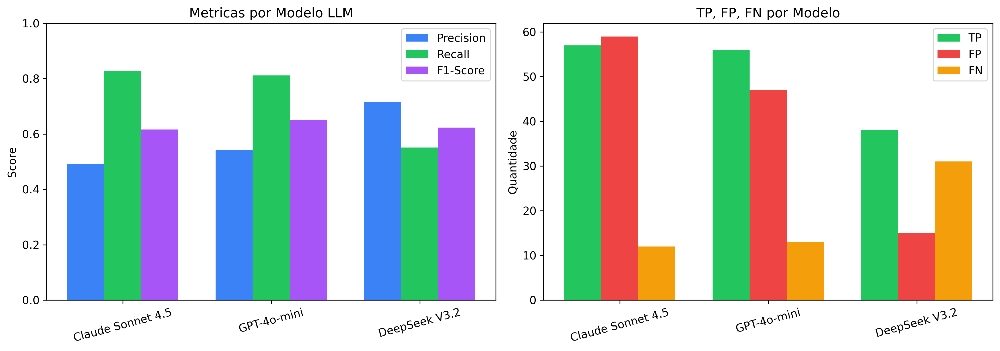
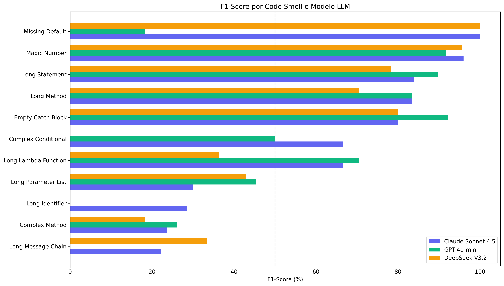
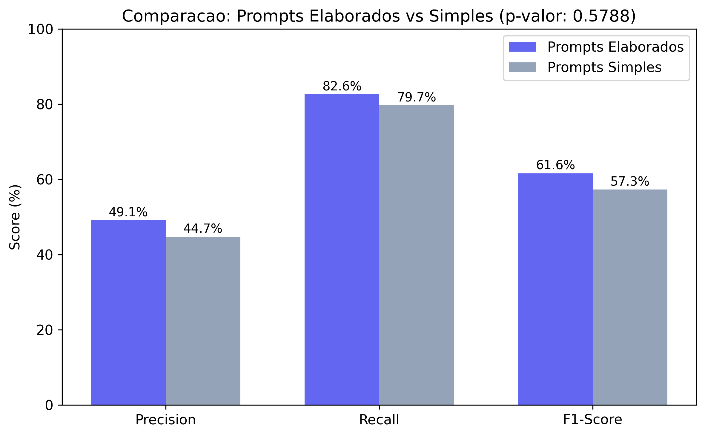
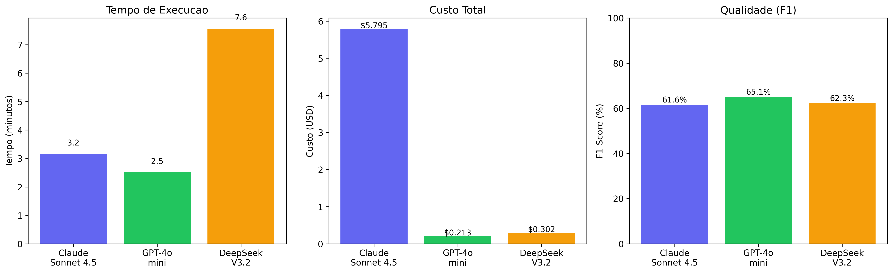

# 📊 Multi-Agent Code Smell Detector - Resultados

> **Trabalho de Conclusão de Curso (TCC)** - Sistema Multi-Agentes para Detecção de Code Smells em Python usando LLMs

## 📌 Sobre

Este repositório contém os **resultados e análises** do projeto de detecção de code smells usando sistema multi-agente baseado em LLM. O código-fonte da API está em um repositório separado.

### 🎯 Objetivo do Projeto

Desenvolver um sistema baseado em LLM multi-agente capaz de detectar 11 tipos de code smells em código Python com alta precisão, combinando análise estática e inteligência artificial.

## 📈 Resultados Principais

### Performance Geral (Melhor Modelo: Claude Sonnet 4.5)

| Métrica | Prompts Elaborados | Prompts Simples |
|---------|-------------------|------------------|
| **F1-Score** | **61.62%** | 57.29% |
| **Precision** | 49.14% | 44.72% |
| **Recall** | 82.61% | 79.71% |
| **TP** | 57 | - |
| **FP** | 59 | - |
| **FN** | 12 | - |

### Comparação entre Modelos LLM

| Modelo | F1-Score | Precision | Recall | Custo Total | Tempo |
|--------|----------|-----------|--------|-------------|-------|
| **Claude Sonnet 4.5** | 61.62% | 49.14% | 82.61% | $5.79 | 3.2 min |
| **GPT-4o-mini** | 65.12% | 54.37% | 81.16% | $0.21 | 2.5 min |
| **DeepSeek V3.2** | 62.30% | 71.70% | 55.07% | $0.30 | 7.6 min |

### Melhor Custo-Benefício

**GPT-4o-mini** apresentou o melhor custo-benefício com F1/$1 = **306.0** (vs Claude: 10.6, DeepSeek: 206.5)

## 🔬 Research Questions

| RQ | Pergunta | Resultado |
|----|----------|----------|
| **RQ1** | Qual a eficácia do sistema multi-agentes? | F1=61.62% com Claude Sonnet 4.5 |
| **RQ2** | Impacto dos prompts na performance? | Elaborados +4.33pp vs Simples |
| **RQ3** | Comparação entre LLMs? | GPT melhor F1 (65.1%), DeepSeek melhor Precision (71.7%) |
| **RQ4** | Performance por agente? | Claude e GPT empatados (5 agentes cada melhor) |
| **RQ5** | Custo-benefício operacional? | GPT-4o-mini melhor (F1/$1=306.0) |

## 🤖 Code Smells Detectados (11 tipos)

| # | Code Smell | Categoria | Threshold |
|---|------------|-----------|------------|
| 1 | **Long Method** | Complexidade | > 67 linhas |
| 2 | **Complex Method** | Complexidade | CC > 7 |
| 3 | **Complex Conditional** | Complexidade | > 2 operadores |
| 4 | **Long Parameter List** | Estrutura | > 4 parâmetros |
| 5 | **Long Message Chain** | Estrutura | > 2 métodos |
| 6 | **Long Statement** | Statements | > 120 caracteres |
| 7 | **Long Identifier** | Nomenclatura | > 20 caracteres |
| 8 | **Magic Number** | Nomenclatura | Literais (exceto 0,1,-1) |
| 9 | **Empty Catch Block** | Statements | Bloco vazio |
| 10 | **Missing Default** | Statements | Sem case _ |
| 11 | **Long Lambda** | Statements | > 80 caracteres |

## 📁 Estrutura do Repositório

```
multi-agent-smell-detector-results/
├── README.md
├── ground_truth/
│   └── implementation_smells_manual_filtered.csv    # 411 smells validados
│
├── results/
│   ├── anthropic/
│   │   └── claude-sonnet-4.5/
│   │       ├── results_complete_prompts.json        # Detecções (prompts elaborados)
│   │       ├── results_simple_prompt.csv            # Detecções (prompts simples)
│   │       ├── results_with_complete_prompts.csv    # CSV formatado
│   │       ├── token_usage_complete_prompts.json    # Uso de tokens e custos
│   │       └── file_metrics_complete_prompts.json   # Métricas por arquivo
│   │
│   ├── openai/
│   │   └── gpt-4o-mini/
│   │       ├── results_complete_prompts.json
│   │       ├── token_usage_complete_prompts.json
│   │       └── file_metrics_complete_prompts.json
│   │
│   └── deepseek/
│       └── deepseek-v3.2/
│           ├── results_complete_prompts.json
│           ├── token_usage_complete_prompts.json
│           └── file_metrics_complete_prompts.json
│
├── figures/
│   ├── fig1_llm_comparison.png
│   ├── fig2_f1_by_smell_comparison.png
│   ├── fig3_cost_analysis.png
│   ├── fig4_prompt_impact.png
│   └── fig5_efficiency_analysis.png
│
├── notebooks/
│   └── research_questions_analysis.ipynb           # Análise completa das RQs
│
└── docs/
    └── smells.md                                   # Definições dos code smells
```

## 📊 Figuras

### Fig. 1 - Comparação entre Modelos LLM


### Fig. 2 - F1-Score por Code Smell


### Fig. 4 - Impacto dos Prompts


### Fig. 5 - Análise de Eficiência


## 📚 Dataset Analisado

| Projeto | Descrição | Arquivos |
|---------|-----------|----------|
| **codespell** | Spell checker para código | 4 |
| **maltrail** | Sistema de detecção de tráfego malicioso | 10 |
| **mava** | Framework para Multi-Agent RL | 6 |
| **Total** | | **20 arquivos** |

**Ground Truth:** 411 code smells validados manualmente em 19 módulos

## 🔗 Links

- **Repositório da API:** [multi-agent-smell-detector](https://github.com/Estevam1to/multi-agent-smell-detector)
- **Paper/TCC:** Em desenvolvimento

## 📖 Referências

1. **Fowler, M.** (1999, 2018). *Refactoring: Improving the Design of Existing Code*
2. **Martin, R. C.** (2008). *Clean Code: A Handbook of Agile Software Craftsmanship*
3. **McCabe, T. J.** (1976). "A Complexity Measure". *IEEE Transactions on Software Engineering*
4. **Chen et al.** (2016). "Detecting Code Smells in Python Programs". *SATE Conference*
5. **MITRE Corporation.** CWE-478: Missing Default Case

## 👨‍💻 Autor

**Luís Estevam Rosa Chaves**  
Engenharia de Software - Universidade Federal do Ceará  
TCC - 2024/2025

## 📄 Licença

Este projeto é parte de um Trabalho de Conclusão de Curso (TCC) acadêmico.